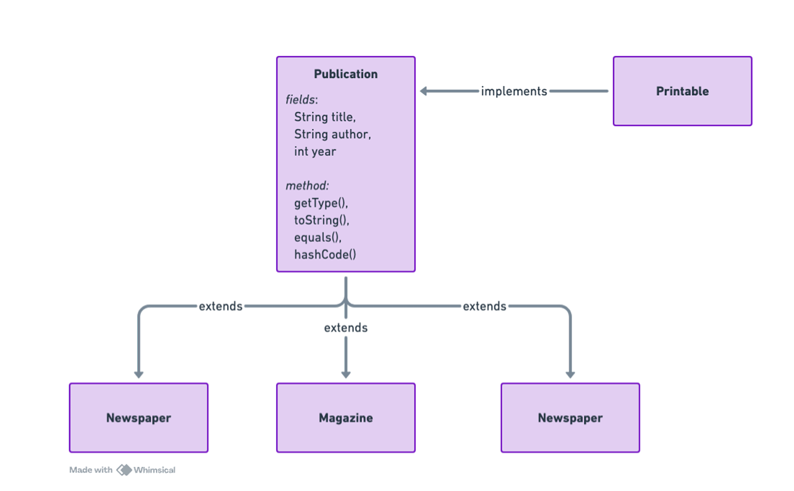

## _Финальный проект модуля “ООПˮ: “Библиотечный Каталогˮ_
### Описание проекта   
В этом проекте вы создадите консольное приложение «Библиотечный Каталог». Приложение позволит
управлять библиотечными публикациями, такими как книги, журналы и газеты. Пользователь сможет
добавлять новые публикации, просматривать список всех публикаций, искать публикации по названию или
автору. При этом проект продемонстрирует применение всех тем, пройденных в модуле:  
* **_ООП и классы:_** вы будете создавать несколько классов для представления публикаций, библиотеки и
вспомогательных компонентов.  
* **_Примитивы и ссылочные типы:_** используйте примитивные типы (например,
int для года выпуска) и
ссылочные типы (например,String для названия).
* **_Инкапсуляция и модификаторы доступа:_** все поля классов будут скрыты 
(private) с доступом через геттеры и сеттеры.
* **_Наследование и полиморфизм:_** создайте абстрактный класс Publication и несколько его наследников
(например, Book, Magazine, Newspaper), чтобы продемонстрировать полиморфизм. 
* **_Абстрактные классы и интерфейсы:_** используйте абстрактный класс для общей логики публикаций и
интерфейс (например, Printable) для задания контракта по выводу подробной информации.
* **_Работа с ключевым словом static:_** реализуйте статическое поле-счетчик для публикаций, чтобы
отслеживать общее количество созданных объектов.
* **_Класс Object и его методы:_** переопределите методы toString(), equals(), hashCode() в ваших классах для
корректного сравнения и удобного представления объектов.
* **_Приведение типов (casting):_** используйте приведение типов, если понадобится обработка объектов по
их конкретному типу из общего списка.

### Необходимые навыки для реализации

Чтобы успешно выполнить проект, вам понадобятся знания и навыки по следующим темам:
* Создание классов и объектов.  
* Работа с примитивными типами (например,int) и ссылочными типами (например,
  String).
* Принципы инкапсуляции, применение модификаторов доступа (private, protected, public).
* Наследование: создание базовых и дочерних классов, полиморфизм.
* Абстрактные классы и интерфейсы: объявление абстрактных методов, реализация интерфейсов.
* Использование ключевого слова static для создания общих полей и методов.
* Переопределение методов класса Object (toString(), equals(),  hashCode()).
* Приведение типов (casting) для работы с объектами в коллекциях.

*
### Детальное описание задания
Классы публикаций
1. Абстрактный класс Publication
   * Поля (private):  
     * String title – название публикации.
     * String author – автор публикации.
     * int year – год выпуска.
   * Конструктор: Инициализирует поля.
   * Абстрактный метод: public abstract String getType(); – возвращает тип публикации.
   * Переопределение методов Object:
     * toString() – должно возвращать информативное строковое представление публикации.
     * equals(Object obj) – сравнение публикаций по полям.
     * hashCode() – вычисление хэш-кода на основе полей.
   * Статическое поле:
     * private static int publicationCount  0; – счетчик созданных публикаций.
   * Статический метод: public static int getPublicationCount() для доступа к счетчику.
   * Геттеры и сеттеры: для всех полей.  
   
2. Конкретные классы-наследники:  
   Создайте классы, наследующие от Publication:  
   * Book: Дополнительное поле String ISBN.
   * Magazine: Дополнительное поле int issueNumber .
   * Newspaper: Дополнительное поле String publicationDay (например, “Понедельникˮ).  
   В каждом классе:  
   * Реализуйте метод getType() (например, для Book верните “Книгаˮ).
   * Переопределите методы toString() , equals() и hashCode() (при необходимости, дополнительно учитывая
   уникальные поля).
   * Реализуйте геттеры и сеттеры для дополнительных полей.

  ### Интерфейс Printable
  * Объявите интерфейс Printable с методом:  
  public interface Printable {  
  void printDetails();   
  }  
  * Пусть каждый из классов-наследников (Book, Magazine, Newspaper) реализует этот интерфейс, выводя
  подробную информацию о публикации (включая поля, специфичные для данного типа).

  ### Класс Library
  Создайте класс Library, который будет управлять коллекцией публикаций.  
  * Поля:  
    * private List<Publication> publications; – список публикаций.
  * Методы:
    * public void addPublication(Publication pub) – добавление публикации в каталог (не забудьте увеличить счетчик
  публикаций в абстрактном классе).
    * public void listPublications() – вывод всех публикаций (используйте метод toString()).  
    * public void searchByAuthor(String author) – поиск и вывод публикаций, где автор совпадает с заданным.
    * Дополнительные методы по желанию (например, удаление публикации).
    
  Диаграмма классов:  

  ### Класс Main
  * Создайте класс Main с методом main().  
  * Реализуйте простое консольное меню:
  * Опция 1: Добавить новую публикацию.
  * Опция 2: Вывести список всех публикаций.
  * Опция 3: Поиск публикации по автору.
  * Опция 4: Вывести общее количество публикаций (используя статический метод).
  * Опция 0: Выход.  
  * При добавлении публикаций предложите пользователю выбрать тип публикации (Book, Magazine или Newspaper) и ввести необходимые данные.
  * Для демонстрации полиморфизма храните все объекты в одном списке типа
  List<Publication>.  
  * При необходимости используйте приведение типов (casting), если вам нужно вызвать специфичные
  методы для конкретного типа публикации (например, если хотите вывести ISBN для книги).
  
### Рекомендации по реализации
1. Пошаговая реализация:
  * Начните с создания абстрактного класса Publication. Реализуйте конструктор, 
  геттеры/сеттеры, и статический счетчик.
  * Переопределите методы toString(), equals(), hashCode() в Publication.
  * Создайте интерфейс Printable с методом printDetails().
    * Реализуйте классы-наследники (Book,Magazine, Newspaper). Добавьте уникальные поля и реализуйте
    метод getType().
  * Убедитесь, что классы корректно реализуют интерфейс Printable (добавьте в printDetails() вывод всех
    данных публикации).
  * Реализуйте класс Library , который будет содержать коллекцию публикаций и методы для управления
    ей.
  * Создайте класс Main с простым консольным меню. Обязательно протестируйте добавление
    публикаций, поиск и вывод информации.
2. Отладка и тестирование:   
  * Тестируйте каждый компонент по отдельности.
  * Проверьте, что статический счетчик публикаций корректно увеличивается при добавлении новой
    публикации.
  * Проверьте работу методов equals() и hashCode(), создавая два объекта с одинаковыми данными и
    сравнивая их.
  * Используйте отладочный вывод (например, System.out.println() ) для контроля правильности работы 
    переопределённых методов.

### Как проверить свою работу
    
После запуска приложения пользователь должен видеть меню с вариантами:  
1. Добавить публикацию:  
    
Пользователь выбирает тип публикации (например, “Книгаˮ) и вводит данные: название, автор, год, а для книги — ISBN.  
Пример ввода:

    Выберите тип публикации: 1 - Book, 2 - Magazine, 3 - Newspaper  
    Введите название: "Война и мир"  
    Введите автора: "Толстой"  
    Введите год: 1869  
    Введите ISBN: "1234567890"  

После этого публикация добавляется в каталог, а статический счетчик увеличивается.  
2. Вывести список публикаций:  
    Приложение выводит список всех добавленных публикаций. Каждый объект должен быть представлен
    через переопределённый метод toString() (например,
    Book{title='Война и мир', author='Толстой', year=1869, ISBN'1234567890'}).
3. Поиск по автору:  
    При вводе, например, “Толстойˮ, приложение выводит все публикации с автором “Толстойˮ.
4. Вывести общее количество публикаций:
    Приложение выводит число, равное суммарному количеству добавленных публикаций (используя
    статический метод Publication.getPublicationCount()).

       💡 Совет: Сделайте несколько тестовых запусков, добавьте несколько публикаций разных типов и
       проверьте корректность работы каждого метода. Также убедитесь, что при выводе
       информации вызываются переопределённые методы, что подтверждает правильное
       использование наследования, полиморфизма и инкапсуляции.
    
    